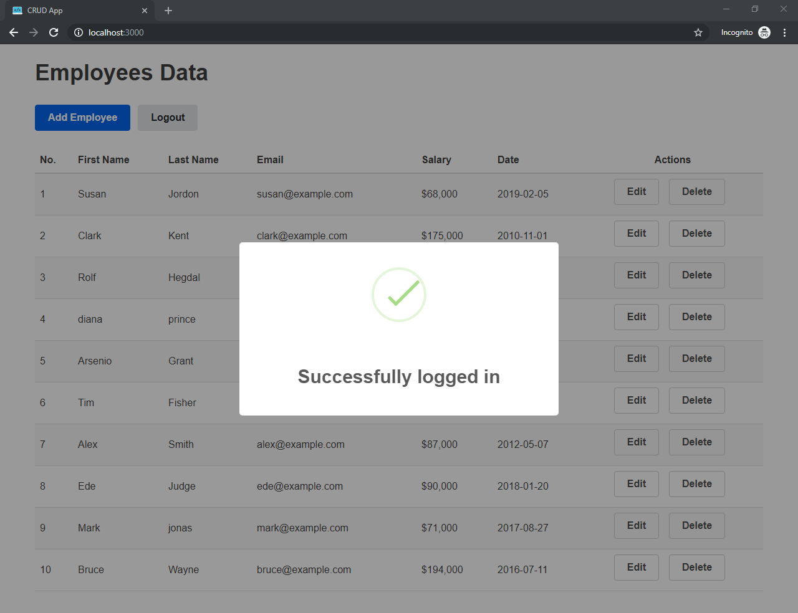

# CRUD App built with React

<p align="center">
  
</p>

## Credentials

- Email: admin@example.com
- Password: qwerty

## Demo

- [CRUD-App](https://safdarjamal.github.io/crud-app)

---

## Development

Install dependencies:

```
npm install
```

### npm scripts

- `npm start` - start development server
- `npm run build` - build into the `build/` directory
- `npm test` - Start the test runner
- `npm run eject` - If you aren’t satisfied with the build tool and configuration choices, you can `eject` at any time. This command will remove the single build dependency from your project.

## License

This CRUD App is an open source software [licensed as MIT](https://github.com/safdarjamal/crud-app/blob/master/LICENSE).
